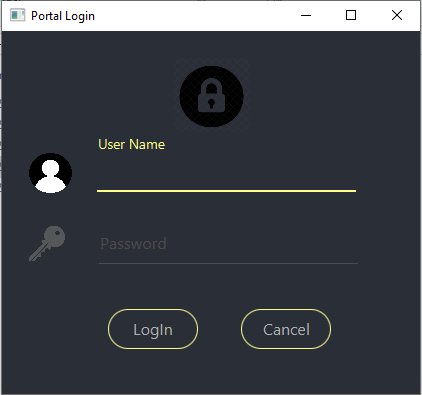
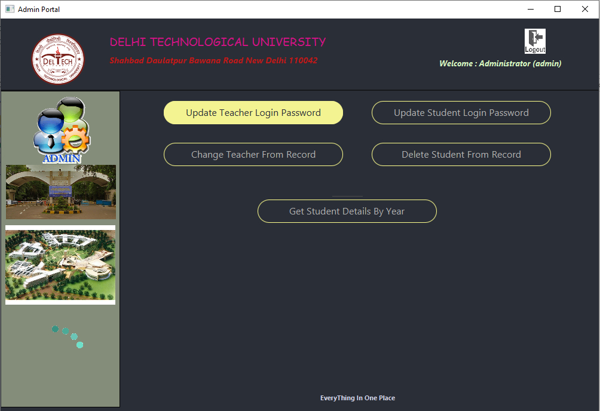
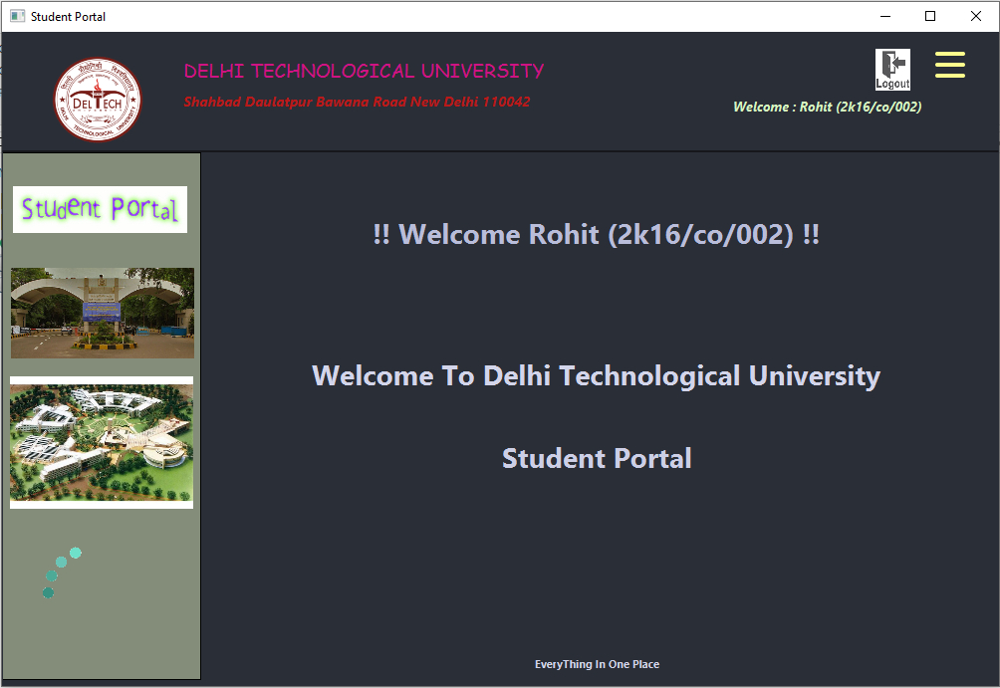
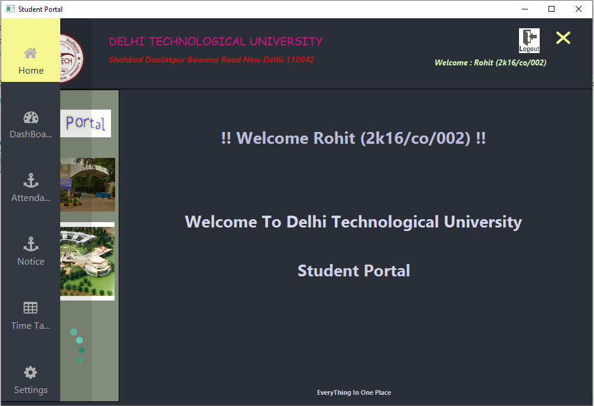
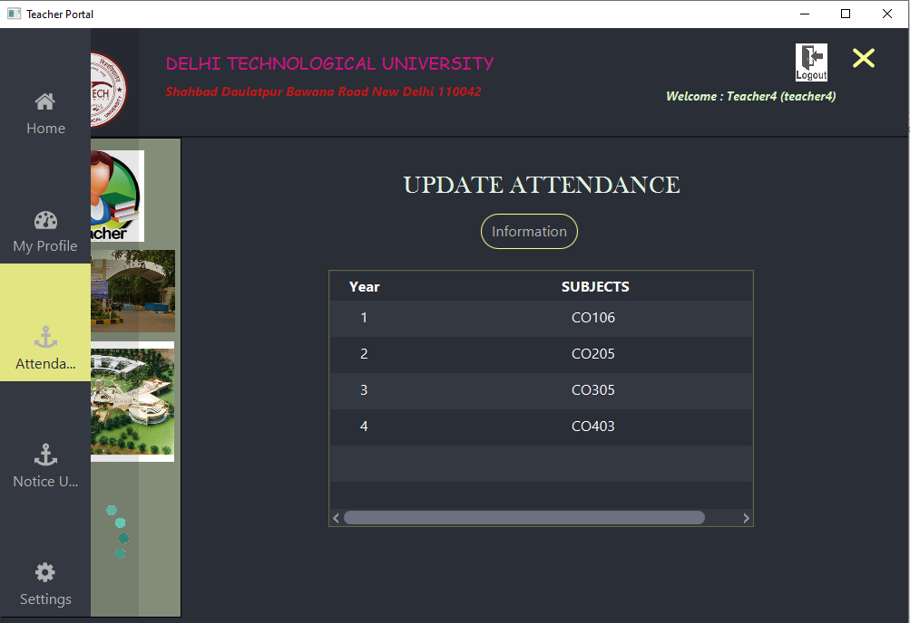
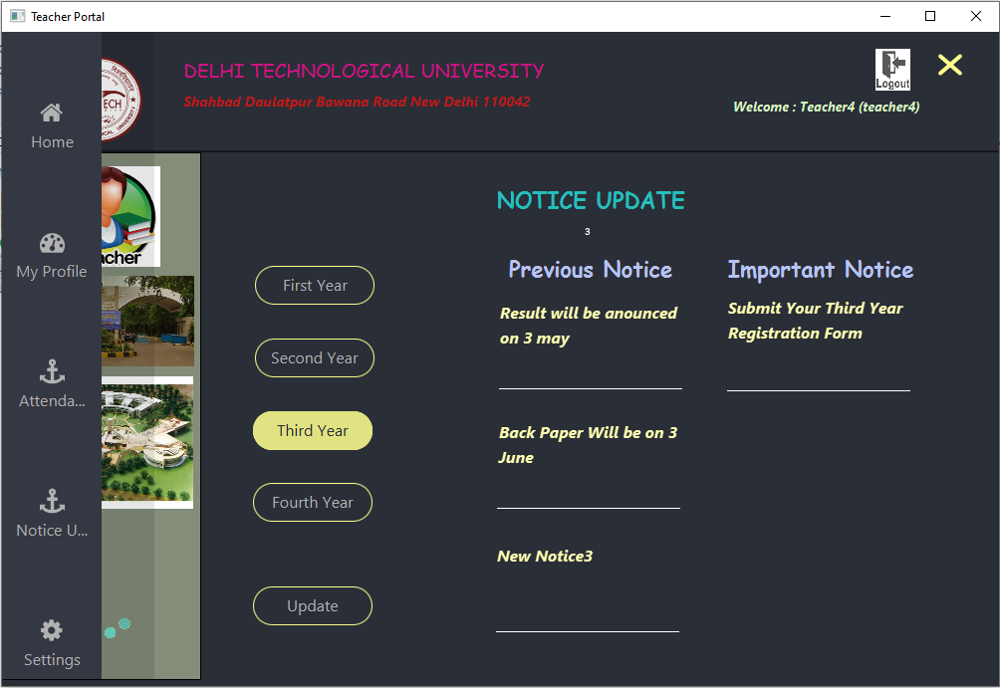
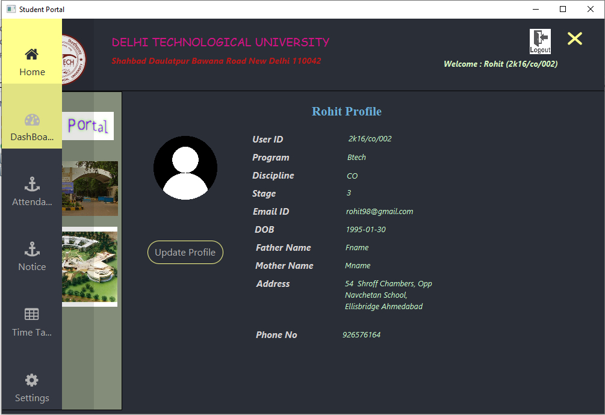

# School Management System

## ScreenShot









## Getting Started

These instructions will get you a copy of the project up and running on your local machine for development and testing purposes. See deployment for notes on how to deploy the project on a live system.


### Prerequisites

Windows/Linux
Java 8 or higher

### For execute Sample Preview

1. Clone Sample_Preview.zip.
2. Extract it to any location.
2. execute CollegeManagement.bat using cmd.
          OR
```
java -jar "Admin_Portal.jar"
```
```
java -jar "Student_Portal.jar"
```
```
java -jar "Teacher_Portal.jar"
```


### Installing
1. Copy this repository.
2. Install XAMPP.
2. Start PHP MyAdmin.
3. Create A new DataBase collegemanagement.
4. Import sql file located at.
```
\Database\clgmanagment.sql
```
5. Now open this project using netbeans ide.
6. Add JAR by right click on Library located at *lib* of respected Project 
7. Run project. 

## Authors

* **Praveen Kumar Sharma** - *Initial work* - [Praveen Kumar Sharma](https://github.com/Praveen101997)

See also the list of [contributors](https://github.com/Praveen101997/College-Management-Syatem/contributors) who participated in this project.

## License
